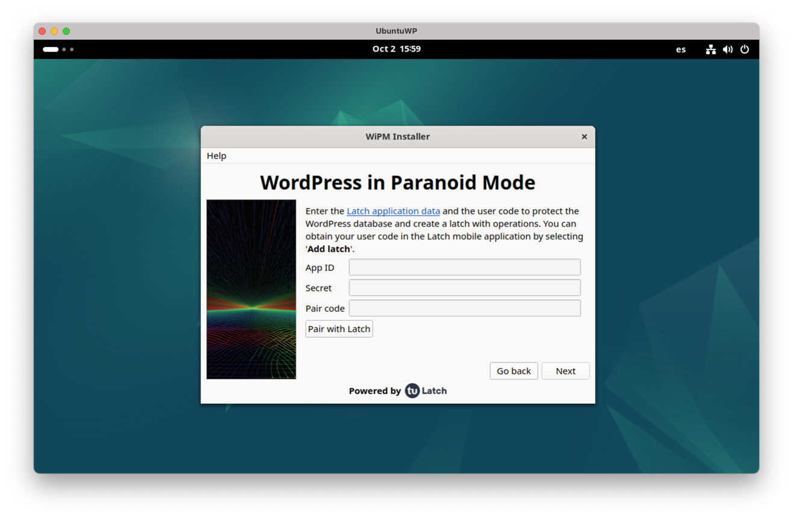

# **WordPress in Paranoid Mode**

**WordPress in Paranoid Mode** allows you to monitor the actions that occur on critical WordPress tables, allowing the owner to enable or disable via a second authorization factor the actions on WordPress tables.

These triggers will communicate with Latch to check the status of the operation to be performed. In case the operation has the latch closed, the trigger will block the query, while in case the operation has the latch open, the trigger will allow the primary action.

WordPress in Paranoid Mode has three execution modes: _Read-Only_, _Edition_ and _Administration_.

- The **_Read-Only_** mode blocks any modification to the critical WordPress tables, preventing changes to user tables, tables of contents, or even preventing any user from logging in
- **_Administration_** mode protects against unauthorized user management.
- **_Edition_** mode protects against unauthorized content publishing.



# Prerequisities

To run the tool, ensure you have the following:

- **MySQL Database**:

  - It must allow external connections and have an administrator user with external access. To create a `root` user with external access, execute the following instructions in MySQL:
    ```sql
    mysql> CREATE USER 'root'@'%' IDENTIFIED BY 'your_password';
    mysql> GRANT ALL PRIVILEGES ON *.* TO 'root'@'%' WITH GRANT OPTION;
    mysql> FLUSH PRIVILEGES;
    ```
  - **Note**: WordPress must be installed in the same database as the one created earlier, but with a different user.

- **wipm-installer**:
  This tool is written in Python and uses various libraries, such as PySide6. It is crucial to have these libraries installed with a compatible version of Python. A version of Python 3, preferably up to version 3.12, is recommended.
  There is a `requirements.txt` file that must be executed the first time the tool is launched using:

  ```bash
  pip install -r requirements.txt
  ```

  Ensure that the `pip` version is oriented to a Python 3 version, preferably up to 3.12.

- **wipm-agent**:
  Python and `pip` must be installed on the system. A version of Python 3, preferably up to version 3.12, is recommended. You can install it by running:

  ```bash
  sudo apt-get install -y python3 python3-pip gunicorn
  ```

  Ensure that the `pip` version is oriented to a Python 3 version, preferably up to 3.12.

- **Latch**:
  - To get the "Application ID" and "Secret", (fundamental values for integrating Latch in any application), it's necessary to register a developer account in Latch's website. On the upper right side, click on ["**Latch Developer area**"](https://latch.tu.com/www/secure/login).
  - To get the "**Pair code**", the user needs the Latch application installed on the phone. From the Latch app on the phone, the user has to generate the code, going to the "**Latches**" page and pressing on "**Add latch**" at the bottom of the application, and will take the user to a new screen where the pairing code will be displayed.

# Usage

It is quite simple to use. If you have all the dependencies installed, you only have to launch the `main.py` file to see the installation interface.

```[python]
python main.py
```

# License

This project is licensed under the GNU Affero General Public License - see the LICENSE file for details
Attributions to third-party software can be found in the licenses_attributions.txt file. These may be contained in portions of code.

# Contact

THE SOFTWARE IS PROVIDED "AS IS", WITHOUT WARRANTY OF ANY KIND, EXPRESS OR IMPLIED, INCLUDING BUT NOT LIMITED TO THE WARRANTIES OF MERCHANTABILITY, FITNESS FOR A PARTICULAR PURPOSE AND NONINFRINGEMENT. IN NO EVENT SHALL THE AUTHORS OR COPYRIGHT HOLDERS BE LIABLE FOR ANY CLAIM, DAMAGES OR OTHER LIABILITY, WHETHER IN AN ACTION OF CONTRACT, TORT OR OTHERWISE, ARISING FROM, OUT OF OR IN CONNECTION WITH THE SOFTWARE OR THE USE OR OTHER DEALINGS IN THE SOFTWARE. WHENEVER YOU MAKE A CONTRIBUTION TO A REPOSITORY CONTAINING NOTICE OF A LICENSE, YOU LICENSE YOUR CONTRIBUTION UNDER THE SAME TERMS, AND YOU AGREE THAT YOU HAVE THE RIGHT TO LICENSE YOUR CONTRIBUTION UNDER THOSE TERMS. IF YOU HAVE A SEPARATE AGREEMENT TO LICENSE YOUR CONTRIBUTIONS UNDER DIFFERENT TERMS, SUCH AS A CONTRIBUTOR LICENSE AGREEMENT, THAT AGREEMENT WILL SUPERSEDE.

This software doesn't have a QA Process. This software is a Proof of Concept.

If you have any problems, you can contact:

ideaslocas@telefonica.com
